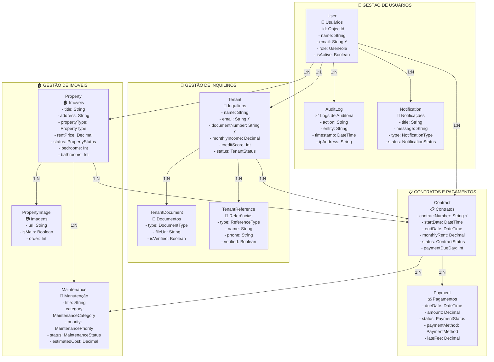

# Diagrama do Banco de Dados - Sistema de Gerenciamento de Aluguéis

## 📊 Visão Geral da Arquitetura

```
┌─────────────────────────────────────────────────────────────────────────────────┐
│                           SISTEMA DE GERENCIAMENTO DE ALUGUÉIS                   │
├─────────────────────────────────────────────────────────────────────────────────┤
│  👤 USUÁRIOS     🏠 IMÓVEIS      👥 INQUILINOS     📋 CONTRATOS     💰 PAGAMENTOS │
│     ↓               ↓              ↓                ↓                 ↓         │
│  🔔 NOTIFICAÇÕES  📊 RELATÓRIOS  🔧 MANUTENÇÃO   📄 DOCUMENTOS    📈 AUDITORIA    │
└─────────────────────────────────────────────────────────────────────────────────┘
```

## 🗂️ Estrutura de Entidades e Relacionamentos

### **Core Entities (Entidades Principais)**



## 🔗 Matriz de Relacionamentos

| **Entidade Principal** | **Relaciona com**  | **Cardinalidade** | **Descrição**                                          |
| ---------------------- | ------------------ | ----------------- | ------------------------------------------------------ |
| 👤 **User**            | 🏠 Property        | 1:N               | Um usuário pode ter múltiplos imóveis                  |
| 👤 **User**            | 👥 Tenant          | 1:1               | Um usuário pode ter um perfil de inquilino             |
| 👤 **User**            | 📋 Contract        | 1:N               | Um usuário (gestor) pode gerenciar múltiplos contratos |
| 👤 **User**            | 🔔 Notification    | 1:N               | Um usuário recebe múltiplas notificações               |
| 👤 **User**            | 📈 AuditLog        | 1:N               | Um usuário gera múltiplos logs de auditoria            |
| 🏠 **Property**        | 📷 PropertyImage   | 1:N               | Um imóvel pode ter múltiplas imagens                   |
| 🏠 **Property**        | 📋 Contract        | 1:N               | Um imóvel pode ter múltiplos contratos (histórico)     |
| 🏠 **Property**        | 🔧 Maintenance     | 1:N               | Um imóvel pode ter múltiplas manutenções               |
| 👥 **Tenant**          | 📄 TenantDocument  | 1:N               | Um inquilino pode ter múltiplos documentos             |
| 👥 **Tenant**          | 🤝 TenantReference | 1:N               | Um inquilino pode ter múltiplas referências            |
| 👥 **Tenant**          | 📋 Contract        | 1:N               | Um inquilino pode ter múltiplos contratos              |
| 📋 **Contract**        | 💰 Payment         | 1:N               | Um contrato gera múltiplos pagamentos                  |
| 📋 **Contract**        | 🔧 Maintenance     | 1:N               | Um contrato pode ter múltiplas manutenções             |

## 📋 Detalhamento por Módulo

### **1. 👤 Módulo de Usuários e Autenticação**

```
┌─────────────────┐
│      User       │
│─────────────────│
│ 🆔 id           │
│ 📧 email*       │
│ 👤 name         │
│ 📱 phone        │
│ 🔐 password     │
│ 🎭 role         │
│ ✅ isActive     │
│ 📅 createdAt    │
└─────────────────┘
        │
        ├── 🔔 Notifications
        ├── 📈 AuditLogs
        ├── 🏠 Properties (se ADMIN/MANAGER)
        └── 👥 TenantProfile (se TENANT)

Enum UserRole:
• ADMIN      - Administrador completo
• MANAGER    - Gestor de imóveis
• TENANT     - Inquilino
```

### **2. 🏠 Módulo de Imóveis**

```
┌─────────────────────┐     ┌─────────────────┐
│      Property       │────▶│ PropertyImage   │
│─────────────────────│ 1:N │─────────────────│
│ 🆔 id               │     │ 🆔 id           │
│ 📝 title            │     │ 🖼️ url          │
│ 📍 address (full)   │     │ 📝 caption      │
│ 🏠 propertyType     │     │ ⭐ isMain       │
│ 💰 rentPrice        │     │ 📊 order        │
│ 📏 totalArea        │     └─────────────────┘
│ 🛏️ bedrooms         │
│ 🚿 bathrooms        │     ┌─────────────────┐
│ 🅿️ parkingSpaces    │────▶│  Maintenance    │
│ 📊 status           │ 1:N │─────────────────│
│ 🎯 amenities[]      │     │ 🆔 id           │
│ 🌍 latitude         │     │ 📝 title        │
│ 🌍 longitude        │     │ 🔧 category     │
└─────────────────────┘     │ ⚡ priority     │
                            │ 📊 status       │
                            │ 💰 cost         │
                            └─────────────────┘

Enum PropertyType:
• HOUSE          - Casa
• APARTMENT      - Apartamento
• STUDIO         - Kitnet/Studio
• COMMERCIAL     - Comercial
• OFFICE         - Escritório

Enum PropertyStatus:
• AVAILABLE      - Disponível
• RENTED         - Alugado
• MAINTENANCE    - Em manutenção
• UNAVAILABLE    - Indisponível
```

### **3. 👥 Módulo de Inquilinos**

```
┌─────────────────────┐     ┌─────────────────┐
│       Tenant        │────▶│ TenantDocument  │
│─────────────────────│ 1:N │─────────────────│
│ 🆔 id               │     │ 🆔 id           │
│ 👤 name + lastName  │     │ 📄 type         │
│ 📧 email*           │     │ 📁 fileUrl      │
│ 📱 phone            │     │ ✅ isVerified   │
│ 🆔 documentNumber*  │     └─────────────────┘
│ 🎂 birthDate        │
│ 💼 occupation       │     ┌─────────────────┐
│ 💰 monthlyIncome    │────▶│TenantReference  │
│ 📊 creditScore      │ 1:N │─────────────────│
│ ⭐ tenantScore      │     │ 🆔 id           │
│ 📊 status           │     │ 🏷️ type         │
│ 📞 emergencyContact │     │ 👤 name         │
└─────────────────────┘     │ 📱 phone        │
                            │ ✅ verified     │
                            └─────────────────┘

Enum TenantStatus:
• ACTIVE         - Ativo
• INACTIVE       - Inativo
• BLACKLISTED    - Lista negra
• PENDING        - Pendente aprovação

Enum DocumentType:
• CPF            - CPF
• RG             - RG
• CNH            - Carteira de Motorista
• INCOME_PROOF   - Comprovante de Renda
• BANK_STATEMENT - Extrato Bancário
```

### **4. 📋 Módulo de Contratos**

```
┌─────────────────────┐     ┌─────────────────┐
│      Contract       │────▶│     Payment     │
│─────────────────────│ 1:N │─────────────────│
│ 🆔 id               │     │ 🆔 id           │
│ 🔢 contractNumber*  │     │ 📅 dueDate      │
│ 📅 startDate        │     │ 💰 amount       │
│ 📅 endDate          │     │ 💳 paidAmount   │
│ 💰 monthlyRent      │     │ 📅 paidAt       │
│ 💰 securityDeposit  │     │ 💳 paymentMethod│
│ 📅 paymentDueDay    │     │ 📊 status       │
│ 📊 status           │     │ ⚡ lateFee      │
│ 🔄 autoRenew        │     │ 🎯 discount     │
│ 📝 terms            │     │ 🆔 transactionId│
│ 📜 specialClauses[] │     │ 🧾 receiptUrl   │
└─────────────────────┘     └─────────────────┘
        │
        ├── 🏠 Property (N:1)
        ├── 👥 Tenant (N:1)
        └── 👤 Manager (N:1)

Enum ContractStatus:
• DRAFT          - Rascunho
• ACTIVE         - Ativo
• EXPIRED        - Expirado
• TERMINATED     - Rescindido

Enum PaymentStatus:
• PENDING        - Pendente
• PAID           - Pago
• OVERDUE        - Em atraso
• PARTIAL        - Pagamento parcial

Enum PaymentMethod:
• PIX            - PIX
• BANK_TRANSFER  - Transferência
• CREDIT_CARD    - Cartão de Crédito
• BOLETO         - Boleto Bancário
```

### **5. 🔔 Sistema de Notificações**

```
┌─────────────────────┐
│    Notification     │
│─────────────────────│
│ 🆔 id               │
│ 📝 title            │
│ 💬 message          │
│ 🏷️ type             │
│ 📡 channel          │
│ 📊 status           │
│ ⏰ scheduledAt      │
│ ✅ sentAt           │
│ 📧 recipientEmail   │
│ 📱 recipientPhone   │
└─────────────────────┘

Enum NotificationType:
• PAYMENT_DUE        - Pagamento próximo
• PAYMENT_OVERDUE    - Pagamento em atraso
• PAYMENT_RECEIVED   - Pagamento recebido
• CONTRACT_EXPIRY    - Contrato vencendo
• MAINTENANCE_REQUEST - Manutenção solicitada

Enum NotificationChannel:
• EMAIL              - Email
• SMS                - SMS
• PUSH               - Push notification
• IN_APP             - Notificação interna
```

## 🔍 Índices e Performance

### **Índices Principais**

```sql
-- Índices únicos (já definidos no schema)
users.email         ⚡ UNIQUE
tenants.email       ⚡ UNIQUE
tenants.documentNumber ⚡ UNIQUE
contracts.contractNumber ⚡ UNIQUE

-- Índices compostos recomendados
properties(ownerId, status)
contracts(propertyId, tenantId, status)
payments(contractId, status, dueDate)
notifications(userId, status, type)
```

### **Consultas Frequentes Otimizadas**

```javascript
// 🏠 Imóveis disponíveis por região
db.properties
  .find({
    status: 'AVAILABLE',
    city: 'São Paulo',
  })
  .sort({ rentPrice: 1 });

// 💰 Pagamentos em atraso
db.payments.find({
  status: 'OVERDUE',
  dueDate: { $lt: new Date() },
});

// 📊 Receita mensal por imóvel
db.payments.aggregate([
  { $match: { status: 'PAID' } },
  {
    $group: {
      _id: '$contractId',
      total: { $sum: '$paidAmount' },
    },
  },
]);
```

## 📊 Métricas e KPIs do Sistema

### **Dashboard Principal**

```
┌─────────────────────────────────────────────────────┐
│                   📊 DASHBOARD                      │
├─────────────────────────────────────────────────────┤
│ 🏠 Total de Imóveis: 150                           │
│ ✅ Ocupados: 120 (80%)                             │
│ 💰 Receita Mensal: R$ 180.000                      │
│ ⚠️ Inadimplência: 5% (R$ 9.000)                   │
│ 🔧 Manutenções Pendentes: 12                       │
│ 👥 Inquilinos Ativos: 120                          │
└─────────────────────────────────────────────────────┘
```

### **Relatórios Disponíveis**

- 📈 **Receita por Período** - Mensal/Anual
- 🏠 **Taxa de Ocupação** - Por tipo de imóvel
- ⚠️ **Análise de Inadimplência** - Por inquilino/imóvel
- 🔧 **Custos de Manutenção** - Por categoria
- 👥 **Rotatividade de Inquilinos** - Tempo médio
- 💰 **Valor Médio de Aluguel** - Por região

---

## ⚙️ Configuração e Deploy

### **Variáveis de Ambiente Necessárias**

```env
DATABASE_URL="mongodb://localhost:27017/rental_management"
JWT_SECRET="your-super-secret-key"
SENDGRID_API_KEY="your-sendgrid-key"
AWS_S3_BUCKET="your-s3-bucket"
STRIPE_SECRET_KEY="your-stripe-key"
```

### **Comandos Prisma**

```bash
# Sincronizar schema com banco
npx prisma db push

# Gerar cliente Prisma
npx prisma generate

# Visualizar dados
npx prisma studio

# Reset do banco (desenvolvimento)
npx prisma db push --force-reset
```

---

_Este diagrama representa a estrutura completa do sistema de gerenciamento de aluguéis, otimizada para escalabilidade, performance e facilidade de manutenção._
